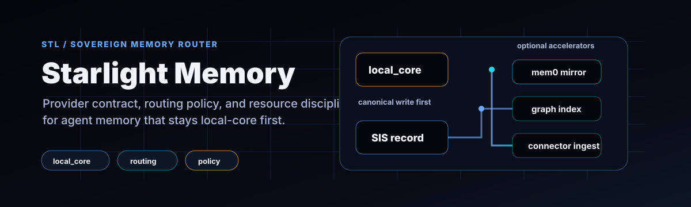

# Starlight Memory

<p align="center">
  
</p>

Sovereign memory provider contract, router, and resource policy for the Starlight Intelligence System.

[](https://github.com/frankxai/starlight-memory/actions/workflows/ci.yml)
[](package.json)
[](https://github.com/frankxai/Starlight-Intelligence-System)
[](docs/ADAPTER_CONTRACT.md)

This repo is the extraction point for the memory layer, and SIS remains the canonical control plane. `local_core` is the sovereign authority (filesystem-native markdown + hybrid recall); everything else — Hindsight, Honcho, Mem0, … — is a scored adapter behind the provider contract.

## Add persistent memory to any coding agent (MCP)

One server, one vault, every agent shares it — Claude Code, Codex, Cursor, Grok, Antigravity:

```bash
npx @starlight-intelligence/memory init --harness all   # writes an MCP snippet per agent
# merge each snippet into that agent's MCP config, then restart it
```

Three tools over stdio: `memory_recall` (hybrid lexical + semantic), `memory_search` (BM25), `memory_remember` (persist a markdown atom). Memory lives as filesystem-native markdown in your vault — sovereign, versioned, yours. Heavy providers fan in through this one gateway; never one runtime per terminal agent.

## Memory Observatory — which memory system should you use?

Starlight Memory keeps a benchmarked, evidence-tagged registry of the adoptable coding-agent memory systems and recommends a stack for your machine + requirements:

```bash
node tools/memory-observatory.mjs list
node tools/memory-observatory.mjs recommend --ram 32 --sovereignty high --privacy high --cross-device --theory-of-mind
```

`local_core` is always the authority; the rest are scored on license, cost, privacy, cross-device, theory-of-mind, and recall benchmark. **Evaluation decides defaults** — see [`docs/STARLIGHT-MEMORY-SYSTEM.md`](docs/STARLIGHT-MEMORY-SYSTEM.md) and run `node eval/provider-recall.mjs` for the scorecard.

## 90-second start

Use this repo when an agent or application needs the SIS memory contract, privacy-aware routing policy, or a lightweight local provider for tests and development.

```bash
git clone https://github.com/frankxai/starlight-memory.git
cd starlight-memory
npm ci
npm run verify
```

Start with:

- [`docs/ADAPTER_CONTRACT.md`](docs/ADAPTER_CONTRACT.md) for provider requirements.
- [`src/types.ts`](src/types.ts) for the canonical SIS memory record and policy types.
- [`src/router.ts`](src/router.ts) for routing behavior.
- [`src/resources.ts`](src/resources.ts) for singleton/shared-daemon constraints.

## Core doctrine

- **SIS/local_core is authoritative.** External systems are adapters, accelerators, or runtime integrations.
- **Provider IDs are secondary indexes.** SIS owns `memory_id`, provenance, privacy class, retention, and trust.
- **Dozens of agents per machine is the target environment.** Heavy providers must run as shared daemons or remote APIs — never one provider runtime per terminal coding agent.
- **Cloud writes are derived/mirrored by policy.** Sensitive memory stays local unless explicit tenant policy allows otherwise.
- **Evaluation decides defaults.** Providers earn default status through recall quality, latency, contradiction rate, cost, privacy, and exportability.

## Cross-machine sync CLI (`starlight-memory`)

A zero-dependency, cross-OS CLI that turns a git repo into a **memory vault** and links your agent's file-based memory dirs into it — so memory is versioned, backed up, and synced across every machine you work on.

Portable by construction:

- **Linking** uses `fs.symlink(type: 'junction')` on Windows (no admin) and `'dir'` symlinks on macOS/Linux — one code path, every OS.
- **Paths are computed per-machine** from a shared, logical-name config — nothing is hardcoded to a username or absolute path.
- **Sync is plain `git`** (any remote — GitHub, GitLab, self-hosted, local bare repo). No cloud SDK, no OS scheduler required.

```bash
# in your (private) vault repo:
npx @starlight-intelligence/memory discover     # list this machine's Claude memory dirs
# add the ones you want to starlight-memory.config.json (see the .example file)
npx @starlight-intelligence/memory wire          # symlink them into the vault
npx @starlight-intelligence/memory sync          # pull, then commit + push changes
npx @starlight-intelligence/memory status        # link state + git status
```

On a second machine: clone the vault, run `wire`, done — memory follows you. Run `sync` from any agent hook, `git` alias, or your own scheduler (launchd / cron / Task Scheduler) for hands-off operation. `unwire` cleanly restores real directories. Keep the vault repo **private** — it holds your actual memories; this package (the tooling) is the public, MIT part.

## Current package surface

```ts
import {
  routeMemoryRecord,
  estimateProviderResourcePlan,
  DEFAULT_PROVIDER_CAPABILITIES,
  type SISMemoryRecord,
  type TenantMemoryPolicy,
} from '@starlight-intelligence/memory';
```

### `routeMemoryRecord(record, policy)`

Routes a SIS memory record through the canonical local write plus optional mirrors:

- `local_core` — always first, always canonical.
- `mem0` — optional redacted cloud fact mirror.
- `hindsight` — graph/entity projection.
- `supermemory` — enterprise connector/session ingest.
- `honcho` — peer/user modeling.
- `holographic`, `openviking`, `byterover` — local/dev memory accelerators.

### `estimateProviderResourcePlan(providers)`

Returns singleton/shared-daemon requirements so provider adapters do not accidentally spawn one heavyweight runtime per agent.

### `InMemoryLocalCoreProvider`

A zero-dependency local provider that implements the adapter contract for tests, development, and hot-path API proof. It enforces tenant isolation, explicit forget, and lexical recall without external services.

### `Mem0RemoteProvider`

A remote-only, client-injected Mem0 adapter. It queues writes, flushes batches, blocks `secret` / `regulated` records by default, and maps Mem0 result IDs back into SIS `provider_shadow_refs` without making Mem0 canonical.

## Adapter contract

See [`docs/ADAPTER_CONTRACT.md`](docs/ADAPTER_CONTRACT.md).

## Development

```bash
npm install
npm test
npm run lint
npm run build
npm run verify
```

## Strategy doc

See [`docs/strategic/sis-memory-provider-strategy-2026-06-18.md`](docs/strategic/sis-memory-provider-strategy-2026-06-18.md).

## 2026-07 Evolution Decision (Superintelligence Layer)

**Decision**: 
- **Primary new component for SIS evolution: Hindsight** (vectorize-io/hindsight).
  - Why: SOTA benchmarks (LongMemEval 91-94%+ vs mem0 ~67%), retain/recall/reflect for *learning* not just recall, mental models + KG align with MemPalace/vaults, self-host sovereignty + low-cost recall, native Hermes provider support.
  - Interconnects: Hermes UI config → starlight-memory HindsightProvider adapter (retain for events, recall for context, reflect for queen/council synthesis) → SIS memory bus/vaults (project models to MemPalace layer) → shared across intelligence systems (Arcanea, brands) via SIP.
- **Complement: Honcho** for dialectic peer/user modeling (sessions, peers, conclusions). Excellent for multi-agent alignment.
- **Current (second-brain-os + starlight-memory local_core + MemPalace + mem0)**: Sovereign base + hybrid. mem0 remains optional extraction accelerator but deprioritized as primary (weaker long-term).
- **Build our own?** Yes — evolve starlight-memory + SIS memory/ as the **sovereign router/orchestrator/policy layer**. These externals are pluggable backends. Never outsource authority. Custom for FrankX multi-brand scale, attestation, hybrid RRF, human-AI collab.
- **Why this evolves SIS**: Turns memory from "recall storage" to compounding intelligence substrate. Agents learn/generalize (Hindsight reflect), humans curate (MemPalace on top), SIS governs (router + queen). Fits superintelligence: persistent, evolvable, sovereign memory across swarms.

**Architecture (Hybrid Sovereign)**:
Local vaults (second-brain + MemPalace) authoritative → starlight-memory router (policy, privacy, hybrid search) → Hindsight (core agent learning bank) + Honcho (peers) + mem0 (optional) → SIS agents/queen use via MCP/bus. Attest every op.

**Execution so far**:
- Created sis-memory-evolution-2026-07.md (full plan, matrix, roadmap).
- Implemented HindsightProvider (adapter stub matching Mem0RemoteProvider contract; retain/recall/reflect mapping).
- Updated resources.ts (full hindsight capabilities) + index.ts (export).
- Hermes already supports config; use Hindsight as default for SIS agents.

**Next (Test/Eval/Implement)**:
1. Wire adapter in SIS (e.g., agent tools, queen reflect).
2. Run evals (extend fan-in-benchmark + LongMemEval-style vs current).
3. Update Hermes/SIS configs + docs for Hindsight primary.
4. Hybrid: Script promote Hindsight mental models → vaults (human gate).
5. Full rollout: Default for new SIS agents; policy for existing.

This is the superintelligent path: best external learning + our sovereign orchestration. Built on SIP.

See full evolution doc for phases, risks, success metrics.

## Relationship to SIS

This repository is created alongside the in-SIS implementation. Short term, SIS consumes/hosts the live operational version under `src/memory-provider/`. Long term, this repo becomes the shared package once the interface survives real adapters and evaluation.

Built on SIP — sovereign memory router.

## Quick usage

```ts
import {
  InMemoryLocalCoreProvider,
  Mem0RemoteProvider,
  type SISMemoryRecord,
} from '@starlight-intelligence/memory';

// Local core (sovereign, hot path)
const local = new InMemoryLocalCoreProvider();
await local.remember(myRecord);

// Mem0 remote (batched accelerator)
const mem0 = new Mem0RemoteProvider({ client: myMem0Client });
await mem0.remember(record);
await mem0.flush(); // explicit batch

// Fan-in safe: dozens of agents route through one instance
```

See tests for full patterns and the fan-in benchmark.
